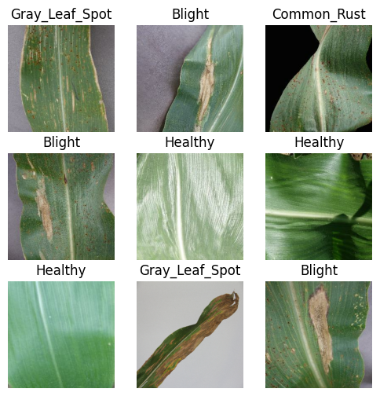

# corn-leaf-diseases-detection
This project focuses on detecting diseases in maize plant leaves using a Convolutional Neural Network (CNN) model.
 #### My goal is to accurately classify different conditions of corn or maize leaves, such as Common Rust, Gray Leaf Spot, Blight, and Healthy.

Manual inspection is challenging and time-consuming, so we explore deep learning for automated classification.

#### The project will include the following steps:
1- Data Collection: The Dataset I used obtained from [Kaggle](https://www.kaggle.com/datasets/smaranjitghose/corn-or-maize-leaf-disease-dataset/data)

2- Load and slipt the dataset: I split the data into training and validation sets. The training set consists of 80% of the images, while 20% are reserved for validation, allowing us to monitor the model’s performance on unseen data.

3- 
```
plt.figure(figsize=(6, 6))
for images, labels in train_ds.take(1):
    for i in range(9):
        ax = plt.subplot(3, 3, i + 1)
        plt.imshow(images[i].numpy().astype("uint8"))
        plt.title(class_names[labels[i]])
        plt.axis("off")
```



